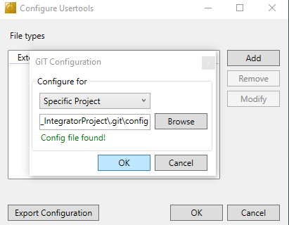
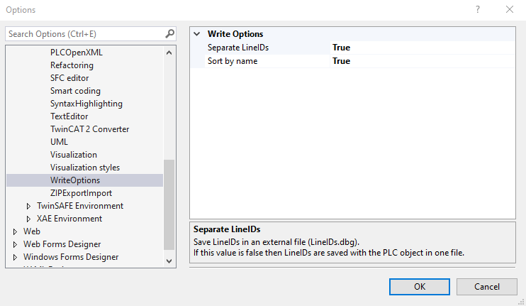
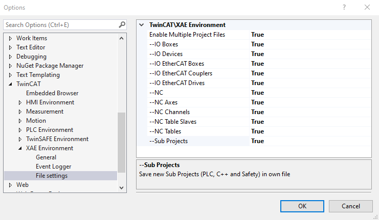
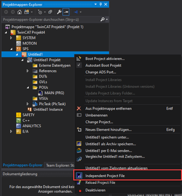
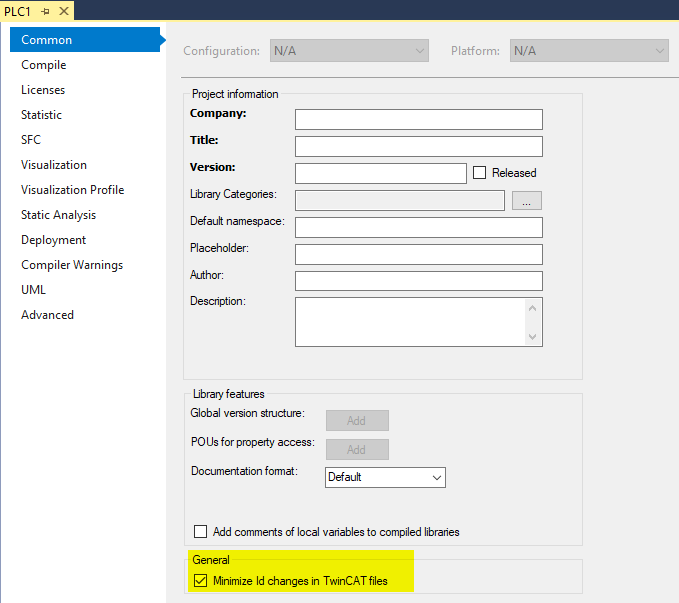
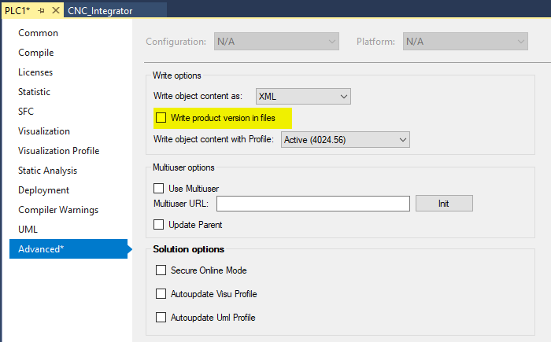

# Best practices XAE environment setup for git in TwinCAT 4024
## Informational video
PLC programming using TwinCAT 3 - Version control (Part 13/18)
https://www.youtube.com/watch?v=1g6eYnlzKtA&t=2866s

## Configuration of the TcProjectCompare for use with source control
This is very important because the TcCompareTool takes care of the controlled comparison and merge of TwinCAT related files.

Complete description of the configuration.
https://infosys.beckhoff.com/content/1033/project_compare_tool/27021597866795659.html?id=7595618039726566519

## Save lineID's to an external file
A lot of internal markers and user bookmarks are no longer saved in the main project file but in separate files. This is easier for merge actions in source control.

## Enable Multiple Project Files
Recommended, it will create a lot of smaller files, Save individual projects, NC axes or IO devices in separate files. Each file contains parameters and settings to that respective object.

It reduces the number of code changes in the main project file. This is easier during code compare.

It avoids the need to have the complete project file checked out when making changes.

* Objects that are saved with Independet Project File are marked with a small floppy disk.
* Black floppy disk, no unsaved changes.
* Red floppy disk, unsaved changes.

Remark: Activate Independent Project File afterwards. If the project were created before creating project possible to manually force creation.

## Minimize ID changes in the PLC project
This minimizes code change detections in source control.

## Remove check 'write project versions' in the PLC project
This minimizes code change detections in source control.

